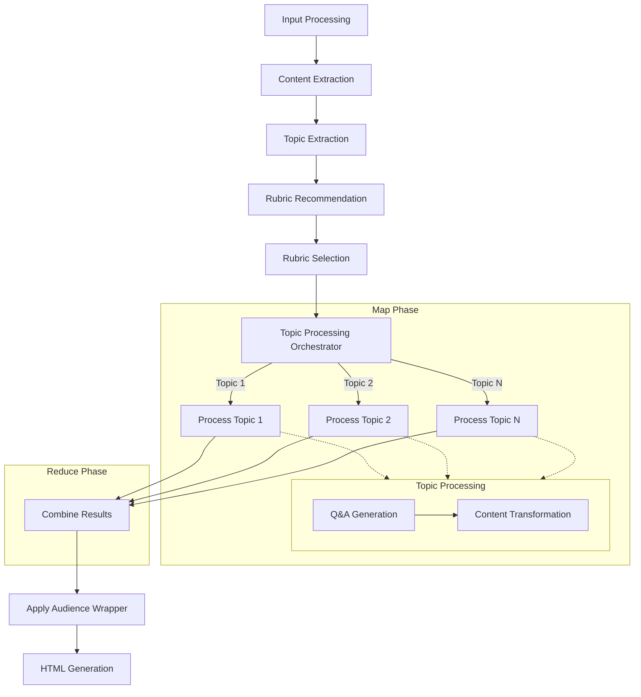

# Design Doc: YouTube Video Summarizer (Expanded)

> Please DON'T remove notes for AI

## Requirements

> Notes for AI: Keep it simple and clear.
> If the requirements are abstract, write concrete user stories

1. As a user, I want to input a YouTube URL and get a summary of the video content
2. As a user, I want to see the main topics covered in the video
3. As a user, I want to see Q&A pairs for each topic to enhance my understanding
4. As a user, I want the summary to be explained in simple terms (ELI5)
5. As a user, I want to view the summary in a well-formatted HTML page
6. As a user, I want to select from multiple document transformation styles (rubrics) for the summary
7. As a user, I want the system to recommend appropriate rubrics based on the video content
8. As a user, I want content that matches a sophisticated audience level, not oriented toward children
9. As a user, I want to see the content transformed according to the selected rubric
10. As a user, I want to control how much external knowledge is incorporated into the content transformation

## Flow Design

> Notes for AI:
> 1. Consider the design patterns of agent, map-reduce, rag, and workflow. Apply them if they fit.
> 2. Present a concise, high-level description of the workflow.

### Applicable Design Pattern:

1. **RAG (Retrieval Augmented Generation)**: We'll retrieve the video content and use it to generate summaries and Q&A pairs
2. **Map-Reduce**: 
   - **Map Phase**: We'll process each topic independently in parallel
   - **Reduce Phase**: We'll combine the results from all topics into a final summary
3. **Agent Pattern**: We'll use LLM inference to recommend appropriate rubrics for content transformation and generate Q&A pairs

### Flow high-level Design:

1. **Input Processing Node**: Validates YouTube URL and extracts video metadata
2. **Content Extraction Node**: Downloads the video transcript/captions
3. **Topic Extraction Node**: Identifies main topics from the transcript
4. **Rubric Recommendation Node**: Analyzes content and suggests appropriate transformation rubrics
5. **Rubric Selection Node**: Facilitates user selection of preferred transformation rubric and knowledge level
6. **Topic Processing Orchestrator Node**: Coordinates the Map-Reduce pattern for topic processing
   - **Map**: Distributes each topic for parallel processing 
   - **Reduce**: Collects and combines all processed topics
7. **Content Transformation Node**: Applies selected rubric and audience wrapper to transformed content
8. **HTML Generation Node**: Creates the final HTML output



## Utility Functions

> Notes for AI:
> 1. Understand the utility function definition thoroughly by reviewing the doc.
> 2. Include only the necessary utility functions, based on nodes in the flow.

1. **YouTube URL Validator** (`utils/validate_youtube_url.py`)
   - *Input*: url (str)
   - *Output*: is_valid (bool), video_id (str)
   - Used by the Input Processing Node to validate YouTube URLs

2. **YouTube Metadata Extractor** (`utils/extract_youtube_metadata.py`)
   - *Input*: video_id (str)
   - *Output*: metadata (dict) containing title, channel, duration, etc.
   - Used by the Input Processing Node to get video information

3. **YouTube Transcript Extractor** (`utils/extract_youtube_transcript.py`)
   - *Input*: video_id (str)
   - *Output*: transcript (str)
   - Used by the Content Extraction Node to get the video transcript

4. **Call LLM** (`utils/call_llm.py`)
   - *Input*: prompt (str)
   - *Output*: response (str)
   - Used by multiple nodes for LLM tasks (topic extraction, Q&A generation, rubric transformation)

5. **HTML Generator** (`utils/generate_html.py`)
   - *Input*: summary_data (dict) containing all processed information
   - *Output*: html_content (str)
   - Used by the HTML Generation Node to create the final output

6. **Recommend Rubric** (`utils/recommend_rubric.py`)
   - *Input*: transcript (str), topics (list)
   - *Output*: recommended_rubrics (list) with confidence scores and justifications
   - Used by the Rubric Recommendation Node to suggest appropriate transformation styles

7. **Apply Rubric** (`utils/apply_rubric.py`)
   - *Input*: content (str), rubric_type (enum), knowledge_level (int, optional)
   - *Output*: transformed_content (str)
   - Used by the Content Transformation Node to transform content according to selected rubric and knowledge level

8. **Apply Audience Wrapper** (`utils/apply_audience_wrapper.py`)
   - *Input*: content (str), audience_level (enum)
   - *Output*: adapted_content (str)
   - Used to adjust content to match specified audience sophistication level

## Node Design

### Shared Memory

> Notes for AI: Try to minimize data redundancy

The shared memory structure is organized as follows:

```python
shared = {
    "video_id": "",                # YouTube video ID
    "video_url": "",               # Original YouTube URL
    "metadata": {},                # Video metadata (title, channel, etc.)
    "transcript": "",              # Full video transcript
    "topics": [],                  # List of extracted topics
    "recommended_rubrics": [],     # List of recommended rubrics with confidence scores
    "selected_rubric": "",         # User-selected rubric type
    "audience_level": "",          # Selected audience sophistication level
    "topic_results": {},           # Map-Reduce results for each topic
    "qa_pairs": {},                # Q&A pairs organized by topic
    "transformed_content": {},     # Content transformed according to selected rubric
    "html_output": ""              # Final HTML output
}
```

### Node Steps

> Notes for AI: Carefully decide whether to use Batch/Async Node/Flow.

1. Input Processing Node
  - *Purpose*: Validate YouTube URL and extract video ID and metadata
  - *Type*: Regular
  - *Steps*:
    - *prep*: Read "video_url" from user input
    - *exec*: Call validate_youtube_url and extract_youtube_metadata
    - *post*: Write "video_id" and "metadata" to the shared store

2. Content Extraction Node
  - *Purpose*: Extract transcript from the YouTube video
  - *Type*: Regular
  - *Steps*:
    - *prep*: Read "video_id" from the shared store
    - *exec*: Call extract_youtube_transcript
    - *post*: Write "transcript" to the shared store

3. Topic Extraction Node
  - *Purpose*: Identify main topics from the transcript
  - *Type*: Batch (process transcript in chunks)
  - *Steps*:
    - *prep*: Read "transcript" from the shared store
    - *exec*: Call LLM to extract topics
    - *post*: Write "topics" to the shared store

4. Rubric Recommendation Node
  - *Purpose*: Analyze content and recommend appropriate transformation rubrics
  - *Type*: Regular
  - *Steps*:
    - *prep*: Read "transcript" and "topics" from the shared store
    - *exec*: Call recommend_rubric to analyze content and suggest appropriate rubrics
    - *post*: Write "recommended_rubrics" to the shared store

5. Rubric Selection Node
  - *Purpose*: Facilitate user selection of preferred transformation rubric and knowledge level
  - *Type*: Regular
  - *Steps*:
    - *prep*: Read "recommended_rubrics" from the shared store
    - *exec*: Present options and capture user selection for rubric and knowledge level
    - *post*: Write "selected_rubric" and "audience_level" to the shared store

6. Topic Processing Orchestrator Node
  - *Purpose*: Coordinate Map-Reduce processing of topics
  - *Type*: Batch (process each topic independently)
  - *Steps*:
    - *prep*: Read "topics", "transcript", and "selected_rubric" from the shared store
    - *map*: For each topic, create a processing task
    - *reduce*: Combine results from all topic processing tasks
    - *post*: Write combined results to the shared store

7. Topic Processor Node
  - *Purpose*: Process a single topic (Q&A generation and content transformation)
  - *Type*: Regular (processes one topic at a time)
  - *Steps*:
    - *prep*: Read topic, transcript, and selected_rubric
    - *exec*: Generate Q&A pairs and apply rubric transformation for the topic
    - *post*: Return processed topic results

8. Audience Wrapper Node
  - *Purpose*: Apply audience sophistication wrapper to transformed content
  - *Type*: Regular
  - *Steps*:
    - *prep*: Read "transformed_content" and "audience_level" from the shared store
    - *exec*: Apply audience wrapper to adjust content to target sophistication level
    - *post*: Update "transformed_content" in the shared store

9. HTML Generation Node
  - *Purpose*: Create HTML visualization of the summary
  - *Type*: Regular
  - *Steps*:
    - *prep*: Read all necessary data from the shared store
    - *exec*: Call generate_html to create HTML output based on selected rubric
    - *post*: Write "html_output" to the shared store

## Document Transformation Rubrics

The system supports the following transformation rubrics:

1. **Insightful Conversational Summary**
   - *Purpose*: Moderate compression preserving conversational tone
   - *Characteristics*: Authentic voice, moderate length, retains quotes and key analogies
   - *Default Knowledge Level*: 5 (Balanced approach)

2. **Analytical Narrative Transformation**
   - *Purpose*: Adds analytical commentary clearly separate from original ideas
   - *Characteristics*: Moderate compression, preserves core arguments, explicitly includes analytical insights
   - *Default Knowledge Level*: 7 (Moderate augmentation)

3. **In-depth Educational Extraction**
   - *Purpose*: Lower compression, aimed at replicating detailed educational content
   - *Characteristics*: Preserves definitions, concepts, and examples with original phrasing
   - *Default Knowledge Level*: 6 (Above average augmentation)

4. **Structured Knowledge Digest**
   - *Purpose*: High compression, concise knowledge delivery
   - *Characteristics*: Organized bullet points, clear headings, prioritization of insights
   - *Default Knowledge Level*: 4 (Below average augmentation)

5. **Emotion and Context-rich Narration**
   - *Purpose*: Captures emotional depth, authentic voice, and nuanced context
   - *Characteristics*: Moderate compression, emphasizes emotional and personal narrative
   - *Default Knowledge Level*: 3 (Low augmentation)

6. **"Top N" Knowledge Extraction**
   - *Purpose*: Summarize content into enumerated, prioritized lists
   - *Characteristics*: Clear ordering, concise summaries, maintains sophisticated language
   - *Default Knowledge Level*: 5 (Balanced approach)

7. **Checklist or Actionable Summary**
   - *Purpose*: Provide concise, actionable steps
   - *Characteristics*: Structured as task-oriented checklists, highly practical
   - *Default Knowledge Level*: 6 (Above average augmentation)

8. **Contrarian Insights (Myth-Busting)**
   - *Purpose*: Identify and clarify misconceptions explicitly
   - *Characteristics*: Structured clearly as myths versus realities, direct language
   - *Default Knowledge Level*: 8 (High augmentation)

9. **Key Quotes or Notable Statements**
   - *Purpose*: Extract direct quotes preserving exact original wording and impact
   - *Characteristics*: Minimal compression, high impact quotes
   - *Default Knowledge Level*: 1 (Pure extraction)

10. **ELI5 (Explain Like I'm Five)**
    - *Purpose*: Simplify complex topics for beginner understanding
    - *Characteristics*: Simple language, basic analogies, concrete examples
    - *Default Knowledge Level*: 5 (Balanced approach)

## Knowledge Augmentation Scale

The system provides a knowledge augmentation scale (1-10) to control how much external knowledge is incorporated into content transformations:

- **Level 1-2**: Pure extraction - only information explicitly stated in the video
- **Level 3-4**: Minimal augmentation - mostly video content with minimal context
- **Level 5-6**: Balanced approach - video content with helpful contextual information
- **Level 7-8**: Significant augmentation - video content enhanced with substantial external knowledge
- **Level 9-10**: Heavy augmentation - extensive external knowledge and analysis

Each rubric has a default knowledge level, but users can customize it during the rubric selection process.

## Audience Sophistication Wrapper

The system applies an audience sophistication wrapper that can be configured to match different audience levels:

- **Sophisticated** (Default): University-level education vocabulary, direct, occasional wit, analytical depth
- **General**: Mainstream audience, balanced vocabulary, neutral tone
- **Child**: Simplified language, concrete examples (used for ELI5 rubric)
