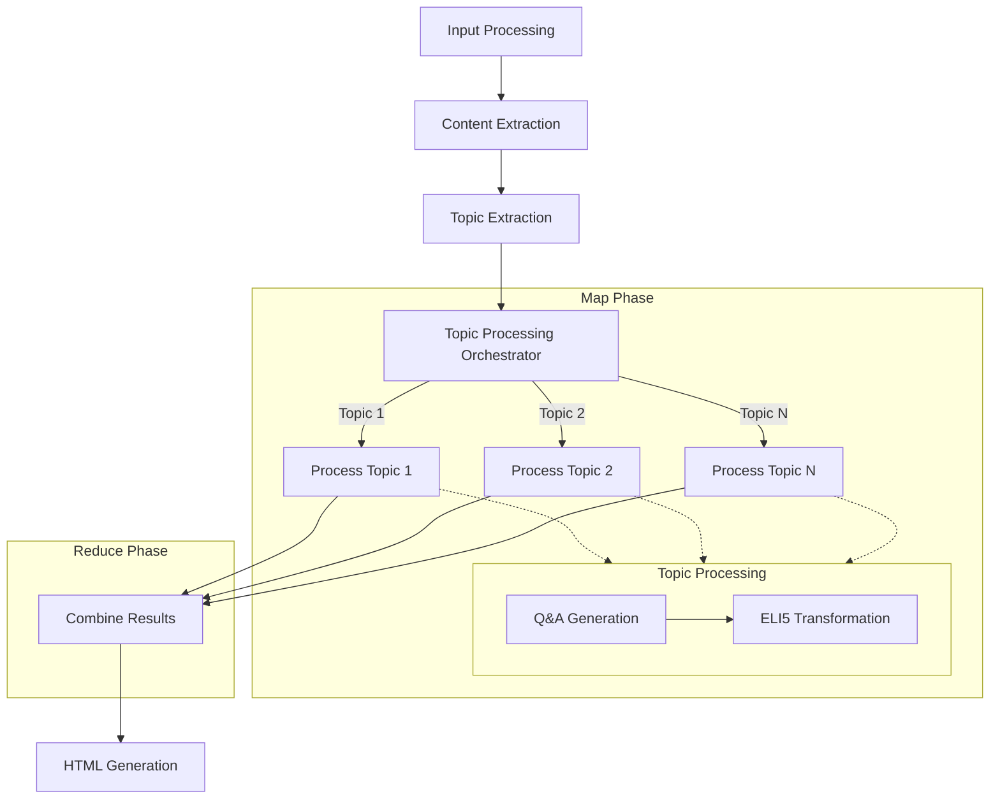

# Design Doc: YouTube Video Summarizer

> Please DON'T remove notes for AI

## Requirements

> Notes for AI: Keep it simple and clear.
> If the requirements are abstract, write concrete user stories

1. As a user, I want to input a YouTube URL and get a summary of the video content
2. As a user, I want to see the main topics covered in the video
3. As a user, I want to see Q&A pairs for each topic to enhance my understanding
4. As a user, I want the summary to be explained in simple terms (ELI5)
5. As a user, I want to view the summary in a well-formatted HTML page

## Flow Design

> Notes for AI:
> 1. Consider the design patterns of agent, map-reduce, rag, and workflow. Apply them if they fit.
> 2. Present a concise, high-level description of the workflow.

### Applicable Design Pattern:

1. **RAG (Retrieval Augmented Generation)**: We'll retrieve the video content and use it to generate summaries and Q&A pairs
2. **Map-Reduce**: 
   - **Map Phase**: We'll process each topic independently in parallel
   - **Reduce Phase**: We'll combine the results from all topics into a final summary

### Flow high-level Design:

1. **Input Processing Node**: Validates YouTube URL and extracts video metadata
2. **Content Extraction Node**: Downloads the video transcript/captions
3. **Topic Extraction Node**: Identifies main topics from the transcript
4. **Topic Processing Orchestrator Node**: Coordinates the Map-Reduce pattern for topic processing
   - **Map**: Distributes each topic for parallel processing through Q&A and ELI5 transformation
   - **Reduce**: Collects and combines all processed topics
5. **HTML Generation Node**: Creates the final HTML output



## Utility Functions

> Notes for AI:
> 1. Understand the utility function definition thoroughly by reviewing the doc.
> 2. Include only the necessary utility functions, based on nodes in the flow.

1. **YouTube URL Validator** (`utils/validate_youtube_url.py`)
   - *Input*: url (str)
   - *Output*: is_valid (bool), video_id (str)
   - Used by the Input Processing Node to validate YouTube URLs

2. **YouTube Metadata Extractor** (`utils/extract_youtube_metadata.py`)
   - *Input*: video_id (str)
   - *Output*: metadata (dict) containing title, channel, duration, etc.
   - Used by the Input Processing Node to get video information

3. **YouTube Transcript Extractor** (`utils/extract_youtube_transcript.py`)
   - *Input*: video_id (str)
   - *Output*: transcript (str)
   - Used by the Content Extraction Node to get the video transcript

4. **Call LLM** (`utils/call_llm.py`)
   - *Input*: prompt (str)
   - *Output*: response (str)
   - Used by multiple nodes for LLM tasks (topic extraction, Q&A generation, ELI5 transformation)

5. **HTML Generator** (`utils/generate_html.py`)
   - *Input*: summary_data (dict) containing all processed information
   - *Output*: html_content (str)
   - Used by the HTML Generation Node to create the final output

## Node Design

### Shared Memory

> Notes for AI: Try to minimize data redundancy

The shared memory structure is organized as follows:

```python
shared = {
    "video_id": "",                # YouTube video ID
    "video_url": "",               # Original YouTube URL
    "metadata": {},                # Video metadata (title, channel, etc.)
    "transcript": "",              # Full video transcript
    "topics": [],                  # List of extracted topics
    "topic_results": {},           # Map-Reduce results for each topic
    "qa_pairs": {},                # Q&A pairs organized by topic
    "eli5_content": {},            # Child-friendly explanations
    "html_output": ""              # Final HTML output
}
```

### Node Steps

> Notes for AI: Carefully decide whether to use Batch/Async Node/Flow.

1. Input Processing Node
  - *Purpose*: Validate YouTube URL and extract video ID and metadata
  - *Type*: Regular
  - *Steps*:
    - *prep*: Read "video_url" from user input
    - *exec*: Call validate_youtube_url and extract_youtube_metadata
    - *post*: Write "video_id" and "metadata" to the shared store

2. Content Extraction Node
  - *Purpose*: Extract transcript from the YouTube video
  - *Type*: Regular
  - *Steps*:
    - *prep*: Read "video_id" from the shared store
    - *exec*: Call extract_youtube_transcript
    - *post*: Write "transcript" to the shared store

3. Topic Extraction Node
  - *Purpose*: Identify main topics from the transcript
  - *Type*: Batch (process transcript in chunks)
  - *Steps*:
    - *prep*: Read "transcript" from the shared store
    - *exec*: Call LLM to extract topics
    - *post*: Write "topics" to the shared store

4. Topic Processing Orchestrator Node
  - *Purpose*: Coordinate Map-Reduce processing of topics
  - *Type*: Batch (process each topic independently)
  - *Steps*:
    - *prep*: Read "topics" and "transcript" from the shared store
    - *map*: For each topic, create a processing task
    - *reduce*: Combine results from all topic processing tasks
    - *post*: Write combined results to the shared store

5. Topic Processor Node
  - *Purpose*: Process a single topic (Q&A generation and ELI5 transformation)
  - *Type*: Regular (processes one topic at a time)
  - *Steps*:
    - *prep*: Read topic and transcript
    - *exec*: Generate Q&A pairs and ELI5 explanation for the topic
    - *post*: Return processed topic results

6. HTML Generation Node
  - *Purpose*: Create HTML visualization of the summary
  - *Type*: Regular
  - *Steps*:
    - *prep*: Read all necessary data from the shared store
    - *exec*: Call generate_html to create HTML output
    - *post*: Write "html_output" to the shared store
